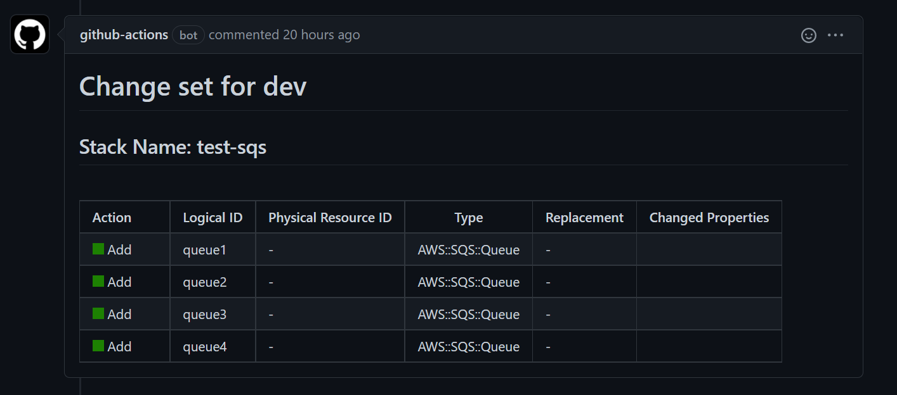

# Describe Cloudformation Change Sets Action

Action to describe AWS CloudFormation stack and generate HTML diff reports.
This takes the results of the [describe-change-set](https://docs.aws.amazon.com/cli/latest/reference/cloudformation/describe-change-set.html)
and generates a nicely formatted HTML table which can be used to comment on a PR. 

## Variables

### Inputs

| Variable      | Description                                                                                                                                                                                                                                   | Default | required |
|---------------|-----------------------------------------------------------------------------------------------------------------------------------------------------------------------------------------------------------------------------------------------|---------|----------|
| stack_name    | Name of Stack                                                                                                                                                                                                                                 |         | true     |
| template_body | Path to template file                                                                                                                                                                                                                         |         | true     |
| options       | Cloudformation deploy additional options. --no-fail-on-empty-changeset --no-execute-changeset already used. Format and documentation for options can be found [here](https://docs.aws.amazon.com/cli/latest/reference/cloudformation/deploy/) |         | false    |
| environment   | Optional Environment name to include in h1 of HTML Report                                                                                                                                                                                     |         | false    |


### Outputs
| Variable    | Description                     | Values        |
|-------------|---------------------------------|---------------|
| has-changes | Whether your stack has changes  | true/false    |
| results     | HTML Report as a string         | A HTML Report |


 
## AWS Requirements

### Credentials and Region
Use the [`aws-actions/configure-aws-credentials` action](https://github.com/aws-actions/configure-aws-credentials) to configure the GitHub Actions environment with environment variables containing AWS credentials and your desired region.

### Permissions
This action requires the following set of permissions:

```json
{
    "Version": "2012-10-17",
    "Statement": [
        {
            "Effect": "Allow",
            "Action": [
                "cloudformation:CreateStack",
                "cloudformation:DescribeStacks",
                "cloudformation:CreateChangeSet",
                "cloudformation:DescribeChangeSet",
                "cloudformation:ListStackResources",
                "cloudformation:DeleteChangeSet",
                "cloudformation:DeleteStack"
            ],
            "Resource": "*"
        }
    ]
}
```

You can restrict this down to specific stacks if desired, please not Ids of change-sets are randomly
generated, so you will require a wildcard,`*`, somewhere in your resource expression.

**Note:** `DeleteStack` is required because if `CreateChangeSet` is called a second time on a stack
that's never been deployed with resources and the state is `REVIEW_IN_PROGRESS` it will fail.

This action checks for the number of deployed resources and this state, 
if it is the resources is `0` and the state is in `REVIEW_IN_PROGRESS` we will delete teh stack.

## Usage

This is an example job configuration to use this action.
```yaml
  describe_changes:
    name: Describe Changes
    runs-on: ubuntu-latest
    # Run only on PRs
    if: ${{ github.event_name == 'pull_request' }}
    # Permission to access aws and write to Pull Requests
    permissions:
      contents: read
      pull-requests: write
    steps:
      # Checkout Current Repository
      - name: Checkout
        uses: actions/checkout@v2
      # Assume role
      - name: Configure AWS credentials from dev account
        uses: aws-actions/configure-aws-credentials@v1
        with:
          aws-access-key-id: ${{ secrets.AWS_ACCESS_KEY_ID }}
          aws-secret-access-key: ${{ secrets.AWS_SECRET_ACCESS_KEY }}
          aws-region: eu-west-1
      - name: Describe Change Set
        id: describe-change-set
        uses: sanjP10/describe-cloudformation-change-sets@1.0.0
        with:
          stack_name: test-sqs
          template_file: cloudformation/sqs.yaml
          options: '--capabilities CAPABILITY_NAMED_IAM --parameter-overrides Key1=Value1 ...'
          environment: 'dev'
      # Write the html output as a comment on the PR
      - name: Add a git comment with Changeset changes
        uses: actions/github-script@v5
        if: steps.plan.outputs.has-changes == 'true'
        env:
          changes: ${{ steps.describe-change-set.outputs.results }}
        with:
          script: |
            github.rest.issues.createComment({
              issue_number: context.issue.number,
              owner: context.repo.owner,
              repo: context.repo.repo,
              body: process.env.changes
            })
```
### Example
This is an example of the report that you can post on your PR.


